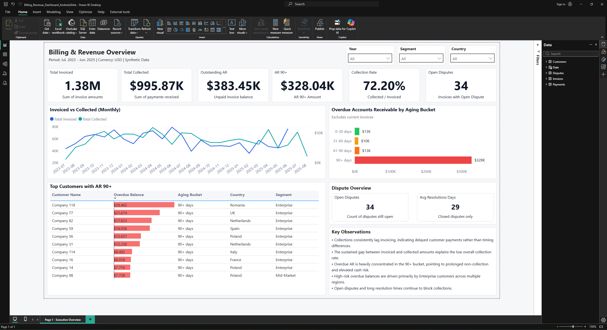

## Dashboard Preview




# Billing & Revenue Analytics – Accounts Receivable Case Study

Finance-focused analytics project analyzing billing performance, cash collection efficiency, and Accounts Receivable (AR) risk using Power BI and DAX.

**Time Period:** Jul 2023 – Jun 2025  
**Currency:** USD  
**Tools:** Power BI, DAX  
**Domain:** Finance Analytics, Accounts Receivable, Revenue Operations  
**Data:** Synthetic (modeled to reflect real-world billing, payment delays, and disputes)

---

## Project Objective

Evaluate revenue realization and AR risk by:
- Comparing invoiced revenue vs cash collected
- Identifying overdue AR exposure and aging risk
- Isolating customer-level concentration in AR 90+
- Assessing disputes as blockers to cash collection

---

## How to Review This Project (Recommended Order)

### 1. Dashboard Snapshot (Quick Visual Overview)
📁 `export/Dashboard_Screenshot.png`

Static preview of the executive dashboard for quick context and layout review.

---

### 2. Executive Dashboard (1-Page PDF)
📁 `export/Billing_Revenue_Dashboard_1pager.pdf`

One-page executive dashboard including:
- Total Invoiced, Total Collected, Outstanding AR, AR 90+
- Collection Rate
- Invoiced vs Collected trend (Invoice Date vs Payment Date)
- Overdue AR by Aging Bucket
- Top Customers with AR 90+
- Dispute Overview and Key Observations

Designed for leadership-level decision support.

---

### 3. Executive Written Analysis
📁 `analysis/Billing_Revenue_Executive_Analysis.pdf`

Concise analytical summary covering:
- Revenue vs cash flow performance
- AR aging risk concentration
- Customer exposure patterns
- Disputes impact on collections
- Actionable next steps

Demonstrates analytical reasoning beyond dashboard visuals.

---

### 4. Power BI Report (Technical Implementation)
📁 `powerbi/Billing_Revenue_Dashboard_AndreiaGhita.pbix`

Includes:
- Star-schema data model
- Time-aware DAX measures
- Invoice vs payment date modeling
- AR aging logic
- Executive-focused visual design

For technical review.

---

### 5. Data & Documentation
📁 `data/`  
📁 `readme/DATA_DICTIONARY.txt`

Synthetic datasets and field definitions used in the analysis.  
All transformations performed within Power BI.

---
``` 
## Project Structure

Billing_Revenue_AR_Analysis/
│
├── data/
│ ├── customers.csv
│ ├── invoices.csv
│ ├── payments.csv
│ └── disputes.csv
│
├── powerbi/
│ └── Billing_Revenue_Dashboard_AndreiaGhita.pbix
│
├── export/
│ ├── Billing_Revenue_Dashboard_1pager.pdf
│ └── Dashboard_Screenshot.png
│
├── analysis/
│ └── Billing_Revenue_Executive_Analysis.pdf
│
└── readme/
├── README.md
└── DATA_DICTIONARY.txt
``` 
---

## Skills Demonstrated

- Accounts Receivable analysis  
- Revenue and cash flow analysis  
- AR aging and risk segmentation  
- Finance KPIs and executive reporting  
- Power BI data modeling and DAX  
- Business-focused data storytelling  

---

## Notes

- All data is synthetic and created for portfolio demonstration.
- Patterns reflect realistic billing, payment delay, and dispute scenarios.
- Project structured to mirror real-world finance analytics workflows.

